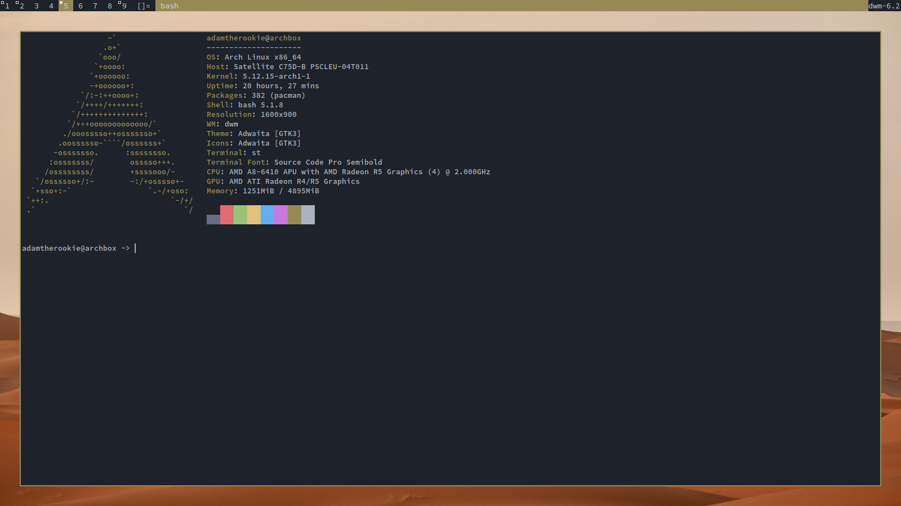

# Warm Brown Color Scheme
A warm brown color scheme with some blue and grey bits.

# Screenshots

# Installation instructions

## Alacritty

1. Paste the contents of `Alacritty/Themer.yml` into your Alacritty config file.
2. Select the desired theme by setting the `colors` config key to reference the scheme's anchor (i.e., `colors: *light` or `colors: *dark`).

## Atom Syntax

Use the `apm link` command to install the generated theme package to Atom:

    apm link 'Atom Syntax/themer-dark-syntax'

Then open/reload Atom and select the desired theme in the list of available syntax themes.

## Atom UI

Use the `apm link` command to install the generated theme package to Atom:

    apm link 'Atom UI/themer-dark-ui'

Then open/reload Atom and select the desired theme in the list of available UI themes.

## Block Wave Wallpaper

Files generated:

* `Block Wave Wallpaper/themer-wallpaper-block-wave-dark-1600x900.png`

## Burst Wallpaper

Files generated:

* `Burst Wallpaper/themer-wallpaper-burst-dark-1600x900.png`

## Chrome

1. Launch Chrome and go to `chrome://extensions`.
2. Check the "Developer mode" checkbox at the top.
3. Click the "Load unpacked extension..." button and choose the desired theme directory (`Chrome/Themer Dark`).

(To reset or remove the theme, visit `chrome://settings` and click "Reset to Default" in the "Appearance" section.)

## CSS

Import the generated theme file into your stylesheet via `@import()`, or into your HTML markup via `<link>`.

`hex.css` provides the theme colors in hex format; `rgb.css` and `hsl.css` in RGB and HSL formats respectively along with individual channel values for further manipulation if desired.

Generated files:

* `CSS/hex.css`
* `CSS/rgb.css`
* `CSS/hsl.css`

## Dot Grid Wallpaper

Files generated:

* `Dot Grid Wallpaper/themer-wallpaper-dot-grid-dark-1600x900-1.png`
* `Dot Grid Wallpaper/themer-wallpaper-dot-grid-dark-1600x900-2.png`

## Emacs

Copy (or symlink) the generated theme file into `~/.emacs.d/`:

    cp 'Emacs/themer-dark-theme.el' ~/.emacs.d/

Then load the desired theme in `init.el`:

    (load-theme 'themer-dark t)

## Firefox Add-on

To use the generated extension package, the code will need to be packaged up and signed by Mozilla.

To package the code in preparation for submission, the `web-ext` tool can be used:

    npx web-ext build --source-dir 'Firefox Add-on/Themer Dark'

Then the package can be submitted to Mozilla for review in the [Add-on Developer Hub](https://addons.mozilla.org/en-US/developers/addon/submit/distribution).

Learn more about Firefox themes from [extensionworkshop.com](https://extensionworkshop.com/documentation/themes/)

To theme Firefox without the need to create a developer account and go through the extension review process, see themer's integration with [Firefox Color](https://color.firefox.com).

## Firefox Color

The Firefox Color add-on allows for simple theming without the need for a developer account or package review process by Mozilla.

1. Install the [Firefox Color add-on](https://addons.mozilla.org/en-US/firefox/addon/firefox-color/).
2. Open 'Firefox Color/themer-dark.url' directly with Firefox.
3. Click "Yep" when prompted to apply the custom theme.

For a more fully featured Firefox theme, see themer's Firefox theme add-on generator.

## Konsole

Copy (or symlink) the generated files to `~/.local/share/konsole/`:

    cp 'Konsole/themer-dark.colorscheme' ~/.local/share/konsole/

Then choose the desired theme in Konsole > Settings > Edit Current Profile > Appearance.

## Octagon Wallpaper

Files generated:

* `Octagon Wallpaper/themer-wallpaper-octagon-dark-1600x900.png`

## prism

In the HTML page where prism.js is being used, link to the generated stylesheet (`prism/themer-prism-dark.css`).

## Sublime Text

1. Copy (or symlink) the generated theme files (`Sublime Text/themer-sublime-text-dark.tmTheme`) to the `User/` packages folder (you can see where this folder is located by choosing the "Browse Packages..." menu option in Sublime Text).
2. Choose the theme from the list of available color themes.

## Terminator

Copy the contents of `Terminator/themer-terminator-dark.txt` to the Terminator's config file.

The config file is usually located at `~/.config/terminator/config`.

You can paste it as a new profile, or copy the contents into your existing profile.

Finally, restart Terminator to see the new theme.

## Vim

Copy or symlink `Vim/ThemerVim.vim` to `~/.vim/colors/`.

Then set the colorscheme in `.vimrc`:

    " The background option must be set before running this command.
    colo ThemerVim

## VS Code

Copy (or symlink) the generated package directory into the VS Code extensions directory:

    cp -R 'VS Code/theme-themer-vscode' ~/.vscode/extensions/

Then reload or restart VS Code. The generated theme package should be in the list of installed extensions, and "Themer Dark" will be available in the list of themes.
